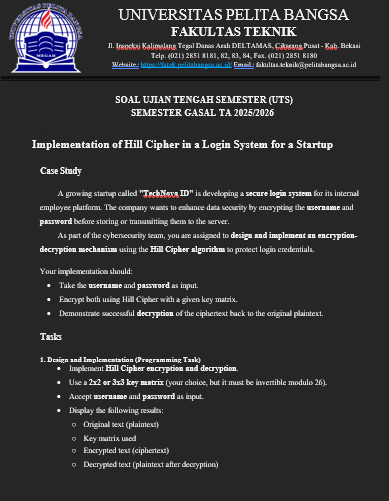

# UTS Pertemuan 8 

|Nama|NIM|Kelas|Mata Kuliah|
|----|---|-----|------|
|**Radityatama Nugraha**|**312310644**|**TI.23.A3**|**Kriptografi**|

# Soal :



## - Code Program :

```python
import numpy as np

MOD = 26

K = np.array([
    [6, 24, 1],
    [13, 16, 10],
    [20, 17, 15]
])
```

### Penjelasan 
```
- Baris import numpy as np digunakan untuk mengimpor library NumPy, yang berfungsi melakukan operasi matematika dan manipulasi matriks.
- MOD = 26 menetapkan nilai modulus 26, karena alfabet Inggris memiliki 26 huruf (A–Z), sehingga setiap operasi enkripsi dan dekripsi dilakukan dalam ruang modulo 26.
- Variabel K adalah matriks kunci (key matrix) berukuran 3×3 yang digunakan dalam algoritma Hill Cipher untuk mengenkripsi dan mendekripsi teks.
```

## - Code Program :

```python
def text_to_numbers(text):
    return [ord(c) - ord('A') for c in text.upper() if c.isalpha()]
```

### Penjelasan 
```
- Fungsi ini mengubah setiap huruf dalam teks menjadi angka.
- Huruf dikonversi menjadi huruf besar dengan text.upper(), lalu hanya huruf alfabet yang diambil (if c.isalpha()).
- Setiap huruf dihitung selisihnya dengan huruf ‘A’ menggunakan ord(c) - ord('A'), sehingga A=0, B=1, ..., Z=25.
- Hasil akhirnya berupa daftar angka yang mewakili huruf teks asli.
```

## - Code Program :

```python
def numbers_to_text(nums):
    return ''.join(chr(int(n) % MOD + ord('A')) for n in nums)
```

### Penjelasan 
```
- Fungsi ini merupakan kebalikan dari text_to_numbers().
- Setiap angka n dikonversi kembali menjadi huruf dengan menambahkan ord('A') setelah diambil sisa bagi 26 (n % MOD).
- chr() mengubah angka menjadi karakter, dan ''.join() menggabungkan semua huruf menjadi satu string.
- Hasil akhirnya adalah teks huruf kapital yang sudah didekripsi atau hasil enkripsi.
```

## - Code Program :

```python
def pad(nums, n):
    while len(nums) % n != 0:
        nums.append(ord('X') - ord('A'))
    return nums
```

### Penjelasan 
```
- Fungsi ini digunakan untuk menambah huruf 'X' (atau nilai 23) jika panjang teks tidak habis dibagi ukuran matriks kunci n.
- Hal ini penting karena Hill Cipher bekerja dengan blok teks sebesar dimensi matriks (misalnya 3 huruf per kali proses).
- Jika teks tidak genap, fungsi ini akan menambahkan karakter hingga panjangnya sesuai.
```

## - Code Program :

```python
def egcd(a, b):
    if a == 0:
        return (b, 0, 1)
    else:
        g, y, x = egcd(b % a, a)
        return (g, x - (b // a) * y, y)
```

### Penjelasan 
```
- Fungsi ini menerapkan Extended Euclidean Algorithm untuk mencari gcd (faktor persekutuan terbesar) antara dua bilangan a dan b.
- Selain gcd, fungsi ini juga mengembalikan koefisien x dan y yang diperlukan untuk menghitung invers modular.
- Hasil (g, x, y) digunakan di fungsi berikutnya modinv().
```

## - Code Program :

```python
def modinv(a, m):
    g, x, y = egcd(a, m)
    if g != 1:
        raise ValueError(f"Tidak ada invers untuk {a} mod {m}")
    return x % m
```

### Penjelasan 
```
- Fungsi ini menghitung invers modular dari angka a terhadap modulus m.
- Invers modular penting untuk melakukan dekripsi dalam Hill Cipher.
- Jika g (gcd) tidak sama dengan 1, berarti tidak ada invers modular dan dekripsi tidak bisa dilakukan.
- Jika ada, hasilnya x % m adalah nilai invers modular yang valid.
```

## - Code Program :

```python
def matrix_mod_inv(A, mod):
    det = int(round(np.linalg.det(A))) % mod
    inv_det = modinv(det, mod)

    cofactors = np.zeros(A.shape, dtype=int)
    for r in range(A.shape[0]):
        for c in range(A.shape[1]):
            minor = np.delete(np.delete(A, r, axis=0), c, axis=1)
            cofactors[r, c] = ((-1) ** (r + c)) * int(round(np.linalg.det(minor)))

    adjugate = cofactors.T % mod
    return (inv_det * adjugate) % mod
```

### Penjelasan 
```
- Fungsi ini mencari invers matriks kunci K dalam modulo 26, yang dibutuhkan untuk proses dekripsi.
- Pertama, menghitung determinan matriks A, lalu mencari invers determinan menggunakan modinv().
- Kemudian, fungsi menghitung matriks kofaktor, diikuti transpose (adjugate) untuk membentuk invers.
- Hasil akhirnya adalah matriks invers dalam modulo 26 yang digunakan dalam dekripsi Hill Cipher.
```

## - Code Program :

```python
def encrypt(plaintext, K):
    n = K.shape[0]
    nums = text_to_numbers(plaintext)
    nums = pad(nums, n)
    cipher_nums = []

    for i in range(0, len(nums), n):
        block = np.array(nums[i:i+n])
        res = (K.dot(block) % MOD)
        cipher_nums.extend(res.tolist())

    return numbers_to_text(cipher_nums)
```

### Penjelasan 
```
- Fungsi encrypt() digunakan untuk mengenkripsi teks asli (plaintext) menggunakan kunci matriks K.
- Panjang teks dijadikan blok sebanyak ukuran matriks (misalnya 3 huruf per blok).
- Setiap blok dikalikan dengan matriks kunci menggunakan operasi matriks K.dot(block) lalu diambil modulus 26.
- Hasilnya adalah daftar angka terenkripsi yang dikonversi kembali menjadi huruf oleh numbers_to_text().
```

## - Code Program :

```python
def decrypt(ciphertext, K):
    n = K.shape[0]
    nums = text_to_numbers(ciphertext)
    Kinv = matrix_mod_inv(K, MOD)
    plain_nums = []

    for i in range(0, len(nums), n):
        block = np.array(nums[i:i+n])
        res = (Kinv.dot(block) % MOD)
        plain_nums.extend(res.tolist())

    return numbers_to_text(plain_nums)
```

### Penjelasan 
```
- Fungsi decrypt() adalah kebalikan dari encrypt().
- Ciphertext diubah ke angka, lalu dikalikan dengan invers matriks kunci (Kinv) untuk mendapatkan kembali teks asli.
- Setiap blok hasil dekripsi diubah kembali menjadi huruf menggunakan numbers_to_text().
- Fungsi ini memastikan bahwa hasil dekripsi sama seperti teks sebelum dienkripsi.
```

## - Code Program :

```python
if __name__ == "__main__":
    username = "radityatama nugraha"
    password = "raditya"

    c_user = encrypt(username, K)
    c_pass = encrypt(password, K)

    print("=== HASIL ENKRIPSI ===")
    print("Plain username :", username)
    print("Cipher username:", c_user)
    print("Decrypt username:", decrypt(c_user, K))

    print("\nPlain password :", password)
    print("Cipher password:", c_pass)
    print("Decrypt password:", decrypt(c_pass, K))
```

### Penjelasan 
```
- Bagian ini adalah program utama yang akan dijalankan ketika file dieksekusi.
- Variabel username dan password berisi teks yang akan dienkripsi menggunakan Hill Cipher..
- Fungsi encrypt() dipanggil untuk mengenkripsi keduanya, dan hasilnya disimpan di c_user dan c_pass.
- Bagian print() digunakan untuk menampilkan hasil: teks asli, hasil enkripsi (ciphertext), dan hasil dekripsi untuk memastikan keakuratan proses.
- Kesimpulannya, bagian ini memperlihatkan bahwa sistem enkripsi-dekripsi Hill Cipher berjalan dengan benar pada data username dan password.
```

# Output :


